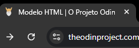

# Fundamentos de HTML

## Introdução a HTML e CSS

HTML e CSS são duas linguagens que trabalham juntas para criar tudo o que vemos quando navegamos na internet. HTML são os dados brutos com os quais uma página web é construída. Todo o texto, links, cartões, listas e botões são criados em HTML. CSS é o que adiciona estilo a esses elementos simples. HTML insere informações em uma página web, e CSS posiciona essas informações, dá cor, altera a fonte e deixa tudo com uma aparência melhor.

HTML e CSS não são linguagens de programação; elas não programam nenhuma lógica, apenas apresentam informações. Jasvascript é uma linguagem de programação porque é usada para fazer páginas da web executarem tarefas.  Não se programa em HTML e CSS, você desenvolve com essas linguagens de marcação.

### HTML

HTML (Hypertext Markup Language) é uma linguagem que determina como documentos e páginas da web são exibidos em um navegador da web, a linguagem dos blocos de construção de qualquer site. Ou seja, HTML serve para criar a estrutura de design da página web e controlar o layut do conteúdo; ele é a fundação de qualquer página web. Dessa forma, HTML é uma linguagem focada em **conteúdo** (textos, imagens, vídeos, tabelas etc)

#### Exemplos:

`<h1>Exemplo de título</h1>` -> os `<h1> e </h1>` são a abertura e fechamento de tag. O que está escrito dentro deles é o conteúdo

`<p>Exemplo de parágrafo</p>`

`imgsrc="foto.png"alt="Exemplo de foto">` -> Tag para colocar foto na tela. `imgsrc` é a abertura de tag, esse tipo não tem fechamento. `alt=` é o parâmetro. `"Exemplo de foto"` é o valor.

#### Estrutura básica:
```
<!DOCTYPE html>
<html lang="pt-br">
    <head>
        <meta charset="UTF-8">
        <meta name="viewport"
        content="width=device-width,
        initial-scale=1.0">
        <title>Document</title>
    </head>
    <body>
        <h1>Olá, Mundo!</h1>
    </body>
</html>
```

`<!DOCTYPE html>` -> tag de configuração que informa que será usado html

`<html lang="pt-br">` e `,/html` -> abertura e fechamento, com o parâmetro que indica o idioma do conteúdo

`<head>` e `</head>` -> um para abrir, outro para fechar. Área de configurações

`<meta charset="UTF-8">` -> codificação que indica que o site será compatível com a acentuações

`<meta name=... e content=` -> o site vai ocupar 100% da parte branca do navegador e vai ser vizualizado numa escala de 100%

`<title>Document</title>` -> título do site

`<body>` e `</body>` -> um para abrir, outro para fechar. Área de corpo, onde fica o site, o conteúdo.

### CSS

CSS (Cascading Style Sheets) é uma linguagem de folha de estilo popular que determina como um documento criado em HTML é estilizado (cores, estilos de fonte, layout e recursos responsivos). Ou seja, CSS serve para estilizar os elementos da página web, deixando-as mais responsivas a tela do usuário e mais atraentes visulamente. Dessa forma, CSS foca em **design** (cores, sombras, tamanhos, posiciionamento etc)

#### Exemplo:

```
h1{
    font-family: Arial;
    font-size: 20pt;
    color: blue;
    }
```
`h1` é o seletor. O que está entre colchetes é a declaração, estou dizendo que a fonte deve ser arial, tamanho 20, e cor azul. `color` e os outros são a propriedade e o que eles informam é o valor. 

### Javascript

O JavaScript permite que você altere elementos CSS e HTML no seu site depois que ele for carregado, o que lhe dá a capacidade de tornar seu site mais interativo e envolvente para os usuários com animações, mídia de vídeo incorporada e muito mais. Ou seja, Javascript é o que dá interatividade à página web, JS controla as funções complexas e as características, é o código de programação que melhora a funcionabilidade ao permitir que você altere efetivamente os componentes HTML e CSS do seu site para corresponder precisamente às suas especificações. Dessa forma, JS foca em **interações** (menus interativos, animações, popups, validações etc)

#### Fontes adicionais: 

https://www.brytdesigns.com/html-css-javascript-whats-the-difference#HTML_Content_Layout

https://youtu.be/B4FU3NFRTDw

## Elementos e Tags

Quase todos os elementos na HTML são pedaços de conteúdo envoltos de tags de abertura e fechamento. 

As **tags de abertura** informam ao navegador que este é o início de um elemento HTML. Elas são compostas por uma palavra-chave entre colchetes angulares <>. Por exemplo: `<p>`. As **tags de fechamento** informam ao navegador onde um elemento termina. São quase iguais às tags de abertura; a única diferença é que têm uma barra antes da palavra-chave. Por exemplo: `</p>`.

EX: `<p>some text content</p>` -> é um elemento de parágrafo completo. `<p>` e `</p>` são as tags de abertura e fechamento. `some text content` representa o conteúdo envolto pelas tags.

Assim, as tags de abertura e fechamento informam ao navegador qual conteúdo o elemento contém. O navegador pode então usar essa informação para determinar como interpretar e formatar o conteúdo. As tags de abertura e fechamento informam ao navegador qual conteúdo o elemento contém. O navegador pode então usar essa informação para determinar como interpretar e formatar o conteúdo. HTML tem uma [vasta lista de tags predefinidas](https://developer.mozilla.org/en-US/docs/Web/HTML/Reference/Elements) que podem ser usadas para criar todos os tipos de elementos. Usar os elementos corretos para o conteúdo é chamado de HTML semântico.

Alguns elementos HTML não possuem uma tag de fechamento. Esses elementos possuem apenas uma única tag, como: `<br>` ou ``. Eles são conhecidos como **elementos vazios** porque não possuem conteúdo, ou seja, não há nada dentro deles. A ausência de uma tag de fechamento significa que eles não podem encapsular conteúdo como outras tags. Também pode-se vê-las sendo chamadas de tags de fechamento automático. Mas elas são apenas elementos nulos com uma barra (/) no final, como: `<br />` ou ``. As tags de fechamento automático podem até ser usadas com frequência por motivos históricos. Os navegadores conseguirão renderizá-las sem problemas, mas a versão mais recente da especificação HTML desencoraja seu uso e as considera inválidas.

## HTML Boilerplate (Modelo/Estrutura Básica HTML)

Na **pasta html-boilerplate**, criei o **arquivo index.html** para praticar. Devemos sempre nomear o arquivo HTML que conterá a página inicial do nosso site como index.html. Isso ocorre porque os servidores web, por padrão, procuram uma index.htmlpágina quando os usuários acessam nossos sites – e não ter uma causará grandes problemas.

O que for explicado aqui será escrito em index.html

### Doctype
Toda página HTML começa com uma declaração de doctype. O objetivo do doctype é informar ao navegador qual versão do HTML ele deve usar para renderizar o documento. A versão mais recente do HTML é o HTML5, e o doctype para essa versão é `<!DOCTYPE html>`.

### Elemento HTML
Após declarar o doctype, precisamos fornecer um elemento `<html>`. Este é o que chamamos de elemento raiz do documento, o que significa que todos os outros elementos do documento serão descendentes dele. Isso se tornará mais importante mais tarde, quando aprendermos a manipular HTML com JavaScript. No index.html, escreverei `<html lang="pt-br">` e `</html>`. 

`lang` representa um atributo HTML associado à tag HTML fornecida. O atributo lang especifica o idioma do conteúdo textual naquele elemento. Este atributo é usado principalmente para melhorar a acessibilidade da página web. Ele permite que tecnologias assistivas, como leitores de tela, se adaptem ao idioma e promovam a pronúncia correta.

### Elemento Principal

O elemento `<head>` é onde colocamos metainformações importantes sobre nossas páginas da web e coisas necessárias para que elas sejam renderizadas corretamente no navegador. Dentro do elemento `<head>`, não devemos usar nenhum elemento que exiba conteúdo na página da web.

Deve-se sempre utilizar a tag `<meta>` com a codificação de caracteres da página web dentro do elemento `<head>`. Como `<meta charset="UTF-8">`. Isso  garante que a página web exibirá símbolos e caracteres especiais de diferentes idiomas corretamente no navegador.

Outro elemento que sempre devemos incluir no cabeçalho de um documento HTML é o `<title>`. Ele é usado para dar às páginas da web um título legível, que é exibido na aba do navegador da nossa página. Por exemplo, se você olhar o nome da aba atual do seu navegador, verá "HTML Boilerplate | The Odin Project"; este é o nome `<title>` do `.html` arquivo atual.



Se não incluíssemos um elemento `<title>`, o título da página web seria, por padrão, o nome do arquivo. No nosso caso, seria index.html, o que não faz muito sentido para os usuários; isso tornaria muito difícil encontrar nossa página web se o usuário tivesse muitas abas do navegador abertas. Há muitos outros elementos que podem ser incluídos no cabeçalho de um documento HTML. No entanto, por enquanto, é crucial conhecer apenas os dois elementos que abordamos aqui.

### Elemento do Corpo

O elemento final necessário para completar o boilerplate HTML é o elemento `<body>`. É nele que todo o conteúdo que será exibido aos usuários será inserido — texto, imagens, listas, links e assim por diante.

### Atalho no VSCode

O VSCode possui um atalho integrado para gerar todo o modelo HTML de uma só vez. No index.html, basta digita `!` na primeira linha a dar `Enter` para escolher a primeira opção.

Esse método trás a linha `<meta name="viewport" content="width=device-width, initial-scale=1.0">`. Não precisamos saber disso até discutirmos design responsivo, um tópico avançado que envolve diferentes tamanhos de tela e que será abordada mais adiante no currículo.

## Trabalhando com Texto

Continuarei testando no index.html

### Parágrafos

Simplesmente escrever dentro de `<body>` fará um texto corrido, sem separação de parágrafos. Não importa como escreva, tudo saírá comprimido em um parágrafo. Por isso, precisamos utilizar os elementos de parágrado, as tags `<p>` e `</p>` são utilizadas para criar parágrafos 

### Headings (Cabeçalhos/Títulos)

As headings são diferentes de outros elementos de texto HTML: eles são exibidos maiores e mais em negrito do que outros textos para indicar que são títulos. Existem 6 níveis diferentes de títulos, começando de `<h1>` a `<h6>`. O título maior e mais importante é h1, enquanto h6 é o menor título no nível mais baixo. Usar o nível correto de título é importante, pois os níveis hierárquicos conferem ao conteúdo uma hierarquia. Um título h1 deve ser sempre usado para o título da página como um todo, e os títulos de nível inferior devem ser usados ​​como títulos para o conteúdo em seções menores da página.

### Elemento `strong`

O elemento `<strong>` deixa o texto em negrito. Ele também marca semanticamente o texto como importante; isso afeta ferramentas, como leitores de tela, que usuários com deficiência visual usarão para usar seu site. O tom de voz em alguns leitores de tela mudará para comunicar a importância do texto dentro de um elemento forte. 

É possível usar o `<>` sozinho, ou em combinação com outros elemento de texto. Às vezes, você vai querer deixar o texto em negrito sem dar a ele um significado importante. Você aprenderá como fazer isso nas lições de CSS mais adiante no currículo.

### Elemento `<em>`

O elemento `<em>` deixa o texto em itálico.  Ele também enfatiza semanticamente o texto, o que pode afetar recursos como leitores de tela. 

Assim como o `<strong>`, é possível utiliza-lo sozinho ou em conjunto com outros elementos.

### Aninhamento e Indentação

Ao longo dos exemplos, fui indentando alguns elementos que estão dentro de outros, isso é aninhar. Quando aninhamos elementos dentro de outros elementos, criamos uma relação de pai e filho entre eles. Os elementos aninhados são os filhos e o elemento dentro do qual estão aninhados é o pai.

No index.html, por exemplo, `<body>` é o pai e `<p>` é o filho.

Indentação é utilizada para tornar o nível de aninhamento claro e legível para nós e outros desenvolvedores que trabalharão com nosso HTML no futuro. Os relacionamentos entre elementos, sejam eles pai, filho ou irmão, se tornarão muito mais importantes posteriormente, quando começarmos a estilizar nosso HTML com CSS e adicionar comportamento com JavaScript. 

### Comentários em HTML

Os comentários em HTML não são visíveis para o navegador; eles nos permitem comentar em nosso código para que outros desenvolvedores ou nós mesmos no futuro possam lê-los e obter algum contexto sobre algo que pode não estar claro no código.

Para escrever um comentário em HTML, basta incluir as tags ``<!--`` e ``-->``.

No VSCode, há um atalho para os comentários: `Ctrl` + `/`. Há também um atalho para lorem ipsun..., basta digita `lorem` + `Enter` que o VSCode completa.

## Listas